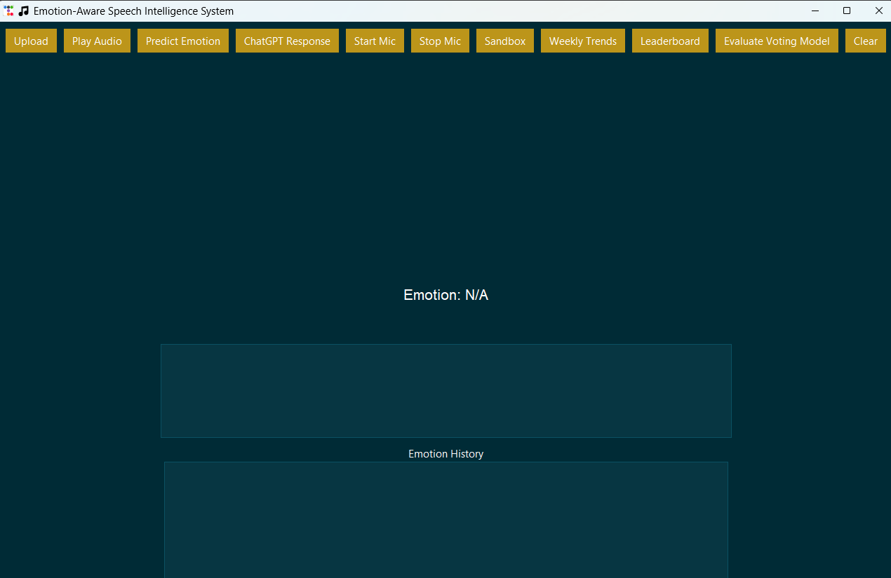
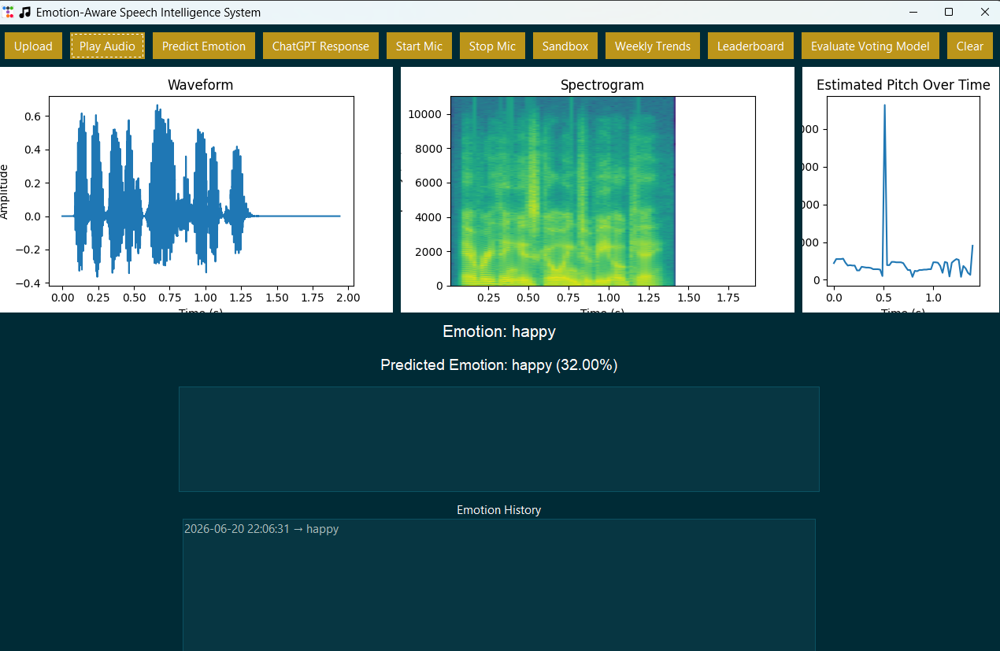
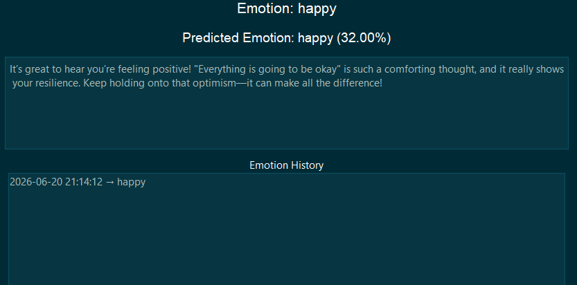
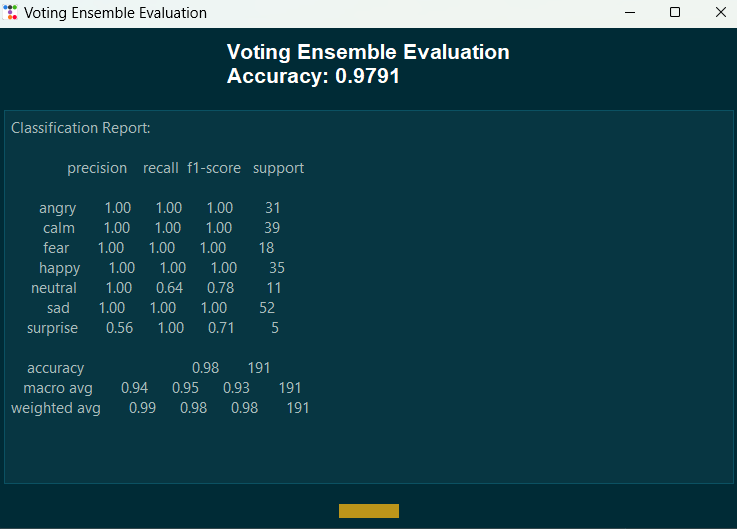
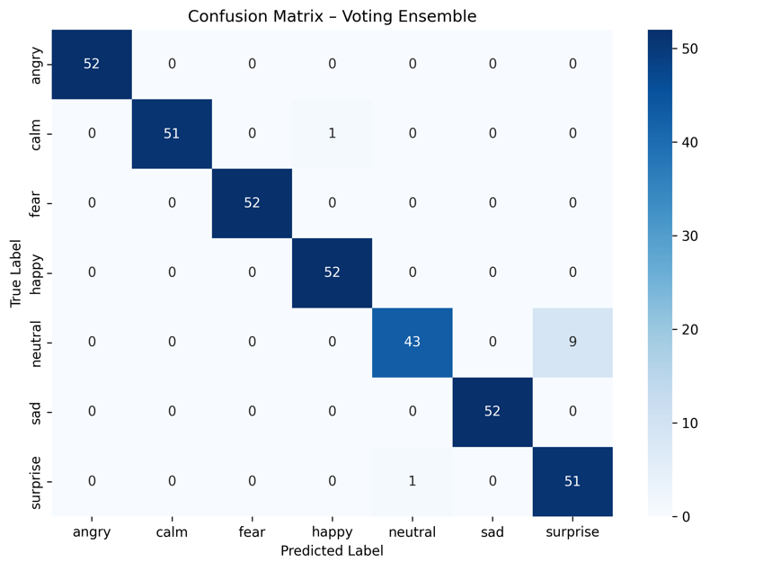

# Emotion-Aware Speech Intelligence System

## Overview

Emotion-Aware Speech Intelligence is a machine learning application designed to analyse speech recordings and identify emotional states from audio input. The system combines audio feature extraction, machine learning classification, explainable AI techniques, and a user-friendly graphical interface to provide emotion predictions and conversational feedback.

This project was developed as part of a Bachelor of Software Engineering (Artificial Intelligence) programme and explores the application of speech analytics, machine learning, and human-computer interaction.

## Key Features

* Emotion recognition from uploaded WAV audio files or microphone input
* Ensemble machine learning models for emotion classification
* Explainable AI using SHAP feature importance visualisations
* Interactive graphical user interface
* Emotion trend tracking and leaderboard analytics
* GPT-powered conversational responses
* Sandbox environment for comparing model predictions against manual labels

## Application Interface
### Main Dashboard


The Emotionally-Sensitive Agent dashboard provides audio upload, emotion prediction, visual analysis, conversational AI responses, trend tracking and model evaluation tools through a single graphical interface.

### Emotion Prediction Example


This example shows the Voting Ensemble model identifying the speaker's emotional state and confidence score from an uploaded speech recording.

### AI-Generated Emotional Response


After emotion prediction, the system uses the detected emotion and user-provided text to generate an emotionally-aware response using OpenAI GPT. The response is displayed in the interface and spoken using emotion-adaptive text-to-speech.

### Voting Ensemble Evaluation


## Model Performance
The final system uses a Voting Ensemble classifier consisting of:

- Random Forest
- Logistic Regression
- K-Nearest Neighbours
- Multi-Layer Perceptron (MLP)

Final evaluation achieved:

- Accuracy: 97.91%
- Weighted F1 Score: 0.98

The model demonstrated strong performance across all supported emotional categories.

### Confusion Matrix


## Technologies Used

* Python
* Scikit-learn
* Random Forest
* Multi-Layer Perceptron (MLP)
* SHAP Explainability
* Pandas
* NumPy
* OpenAI API
* Tkinter GUI

## Supported Emotions

* Happy
* Sad
* Angry
* Neutral
* Fear
* Surprise
* Calm

## Future Improvements

* PDF summary exports
* Avatar-based emotion visualisation
* Multilingual support
* User authentication and saved history
* Real-time emotion monitoring

## Setup Instructions

### Create and activate a virtual environment

```bash
python -m venv .venv
```

Windows:

```bash
.venv\Scripts\activate
```

### Install dependencies

```bash
pip install -r requirements.txt
```
If dependency issues occur, update the OpenAI libraries:
```bash
pip install --upgrade openai httpx
```

### Run the application

```bash
python gui_app.py
```
### OpenAI API Key

Create an environment variable named:

```bash
OPENAI_API_KEY
```

and set it to your OpenAI API key before running the application.

## How to Use the Emotionally-Sensitive Agent

### 1. Upload Audio

Click **Upload** and select a WAV audio file containing a spoken sentence.

### 2. Play Audio

Click **Play Audio** to listen to the uploaded recording and verify the correct file has been loaded.

### 3. Predict Emotion

Click **Predict Emotion** to analyse the speech recording. The system extracts acoustic and spectral features before using the trained Voting Ensemble model to predict the speaker's emotional state and confidence score.

### 4. ChatGPT Response

Click **ChatGPT Response** and enter the sentence spoken in the recording. The system uses the predicted emotion together with the user’s text to generate an emotionally-aware response. The response is displayed in the interface and spoken aloud using emotion-specific text-to-speech settings.

### 5. Record Live Audio

To test live speech:

1. Click **Start Mic**
2. Speak a sentence using any emotional tone
3. Click **Stop Mic**
4. The recording is automatically saved to the recordings folder

Before loading a new recording, click **Clear** to reset the interface.

### 6. Analyse Recorded Audio

After recording:

1. Click **Upload**
2. Select the newly created recording from the recordings folder
3. Click **Play Audio**
4. Click **Predict Emotion**
5. Click **ChatGPT Response**

This allows the system to analyse the recorded speech and generate an emotionally-aware reply.

### 7. Sandbox Testing

If the predicted emotion appears incorrect, use **Sandbox**.

The Sandbox allows users to:

* Load an audio file
* View the model's predicted emotion
* Enter the correct emotion manually

This provides a simple method for comparing model predictions against human judgement.

### 8. Weekly Trends

Click **Weekly Trends** to visualise emotional predictions over time. The system generates a trend chart based on the stored prediction history.

### 9. Leaderboard

Click **Leaderboard** to display the frequency of each detected emotion. This provides a ranking of the most commonly predicted emotional states.

### 10. Evaluate Voting Ensemble

Click **Evaluate Voting Model** to assess the final trained model.

The evaluation displays:

* Classification accuracy
* Precision, recall and F1-score
* Confusion matrix
* ROC curve visualisation

These results demonstrate the performance of the final Voting Ensemble classifier used within the application.

### 11. Clear

Click **Clear** to reset the interface, remove displayed results, clear loaded audio files and prepare the system for a new analysis session.

### 12. Exit Application

Close the application window when finished.
